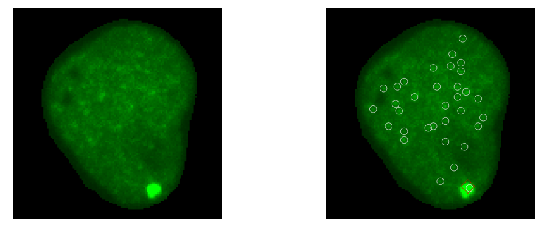

# StageM2 

## Description
This package is used to detect and quantify spots in live cells. 
It use BigFish and BigFish live to quantify single molecules and clusters in live movies. 
| Cell image (smFISH channel) before and after detection |
|------------- |
|  |
## Table of Contents 
1. [Installation](#installation)
2. [Usage](#usage)
3. [Contributing](#contributing)
4. [License](#license)

## Installation 
Clone the project's [Github repository](https://github.com/raphaeluniversitebdx/StageM2.git) with the following command : 

```
git clone https://github.com/raphaeluniversitebdx/StageM2.git
```
To avoid dependency conflicts, we recommend to use [conda](https://docs.conda.io/projects/conda/en/latest/user-guide/tasks/manage-environments.html). 

You need to create 2 distincts Anaconda environments : 
- segmentation
- detection 

each environment has it own yml file in their respective folders. 

In a terminal run :
```
conda env create -f environment_detection.yml
conda env create -f environment_segmentation.yml

conda activate name/of/the/environment 
```

## Usage

### Description of the pipeline 
The pipeline consist of the following steps :
1. [segmentation of cells](#segmentation)
2. [tracking of the cells](#tracking)
3. [Centering and Cropping of the cells](#cropping)

4. [get threshold](#threshold)
5. [Build Reference spot](#refspot)
6. [Quantification of the clusters](#quantification)

### Segmentation
#### Segmentation
This step consist to detect the outlines of the cells present in the movies. 
This operations is realised by using the pre-trained model of [Cellpose](https://github.com/mouseland/cellpose). 

#### Tracking
This step consist to assign for each cells detected during segmentation an unique label throughout the movie. 
The tracking is done by using [Ultrack](https://github.com/royerlab/ultrack/tree/main). 

#### Centering and cropping of the cells 
When the tracking is done, you need to crop the cells to get individual movies for each tracked cells. 
First we will center each cell throughout the movie and when it's done we will crop them. 

### Detection and Quantification

The following step will mainly use [BigFish](https://github.com/fish-quant/big-fish) and [BigFishLive](https://github.com/rachel-kt/bigFishLive/tree/main). 
See the associated documentation for more details. 

#### Quantification 

In the case of the quantification of large clusters, additionnal operations will be done to get the most accurate results. 

## Contributing 

[Pull requests](https://github.com/raphaeluniversitebdx/StageM2/pulls) are welcome. For major changes, please open an [issue](https://github.com/raphaeluniversitebdx/StageM2/issues) first to discuss what you would like to change.


