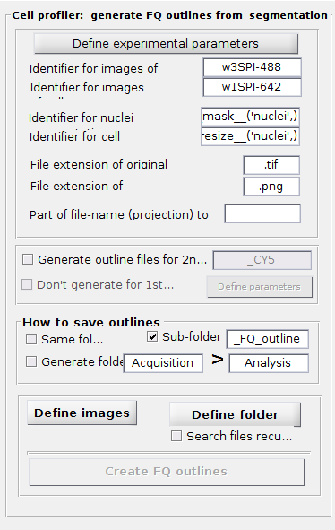
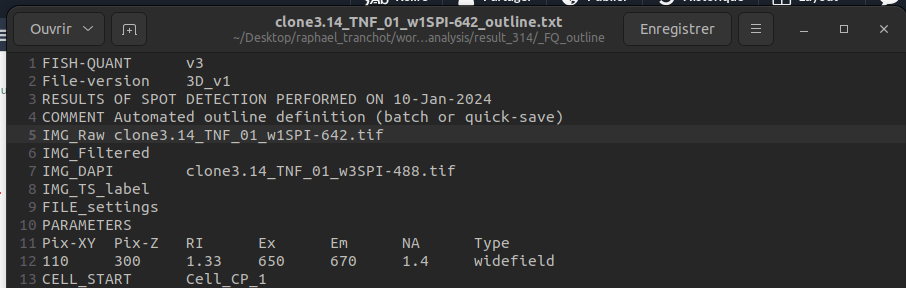

# Tutorial

## Description
This is a tutorial to create outline.txt files usable in matlab.

## Table of contents
1. [2D Projection](#projection)
2. [segmentation](#segmentation)
3. [Creation of the outline in matlab](#outline)
4. [Rename the outline.txt files](#rename)
5. [Open in matlab](#matlab)

   
## 2D Projection 
First you need to realise a 2D projection of the image.
This can be done by using ImageJ and this [script](https://github.com/raphaeluniversitebdx/StageM2/blob/main/segmentation_fixed_cells/Z_project_all_file_mac).
 

## segmentation
With the 2D projection, the segmentation will be done by using [fq-segmentation](https://github.com/fish-quant/fq-segmentation/).
The notebook [segment-nuclei](https://github.com/fish-quant/fq-segmentation/blob/master/notebooks/segment-cells-nuclei.ipynb) or [segment-cells-nuclei](https://github.com/fish-quant/fq-segmentation/blob/master/notebooks/segment-cells-nuclei.ipynb) can be use depending on what you want to achieve. 

## Creation of the outline in matlab
The creation of the outline will be done by using [FISH-QUANT).

| Cell Profiler of FISH-QUANT |
|------------- |
| |

Identifiers : 
1. for DAPI images : w3SPI-488
2. for FISH images : w1SPI-642
3. for nuclei segmentation : \_\_mask_\_('nuclei',)
4. for cell segmentation : \_\_mask\_resize_\_('nuclei',)

## Rename the outline.txt files
When the outlines are done you need to rename the outline.txt file and change the line 4. 

| Exemple of outline file |
|------------- |
| |

You can use the [Txt change.ipynb](https://github.com/raphaeluniversitebdx/StageM2/blob/main/segmentation_fixed_cells/Txt%20change.ipynb) rename the files. 

